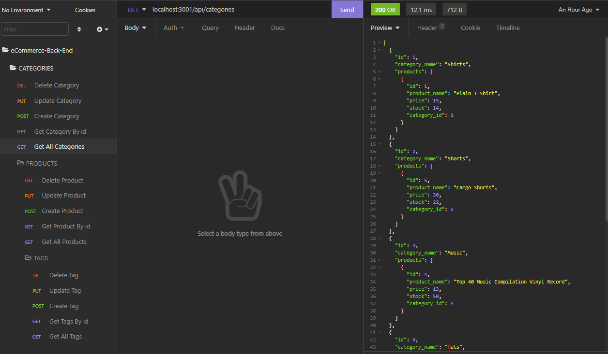

# E-Commerce-Back-End

## Objective:

Building the back end for an e-commerce site by using Express.js API and Sequelize to interact with a MySQL database. 

## Details:

* I add my database name, MySQL username, and MySQL password to an environment variable file. Then I'm able to connect to a database using Sequelize. 

* Then I enter schema and seed commands.  Then a development database is created and is seeded with the data. 

* Then when I enter the command to invoke the application my server is started and the Sequelize models are synced to the MySQL database.
    * node seeds (Seed the file)
    * npm start (Start the server in localhost:3001/)

* I then open the API GET routes in Insomnia Core for: 
(The data for each routes are displayed in a formatted JSON)
    * categories
    * products
    * tags

* I then test the API POST, PUT and DELETE routes in Insomnia and able to then create, update and delete data in my database.

-------
https://github.com/Maripia12/E-Commerce-Back-End

https://drive.google.com/file/d/1-cQo6xNN3Sy2yAORWAs4LZjaJ4bnnK-7/view

